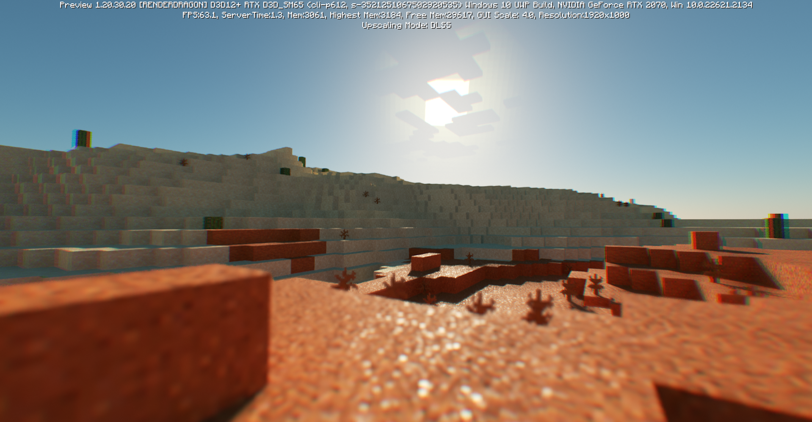
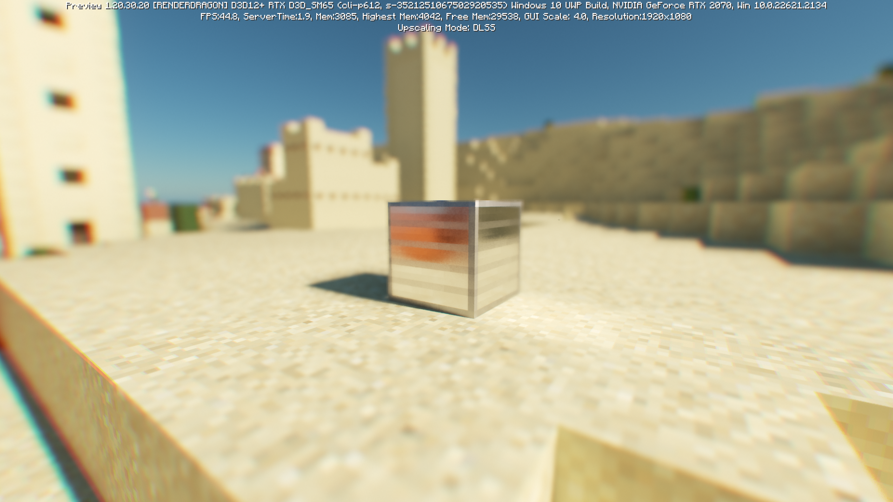
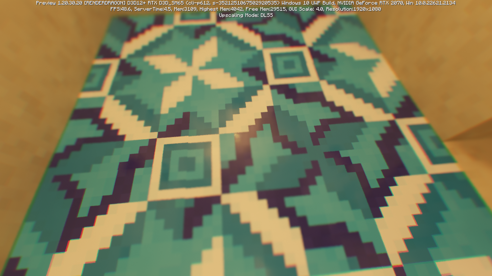
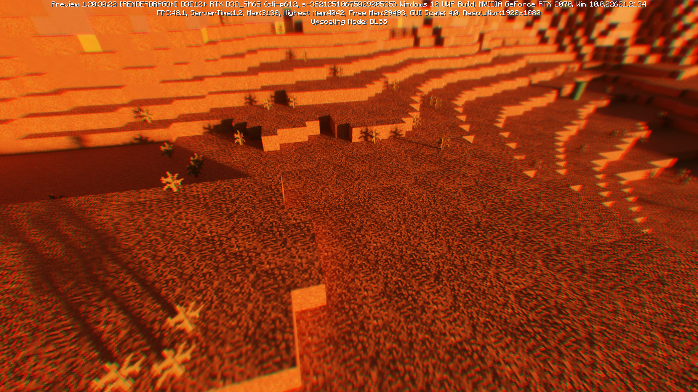
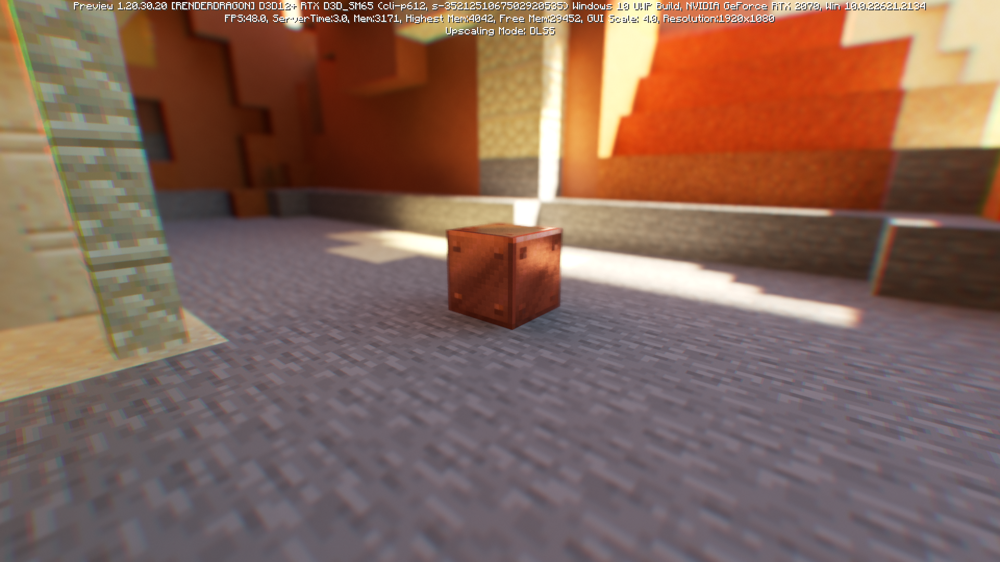
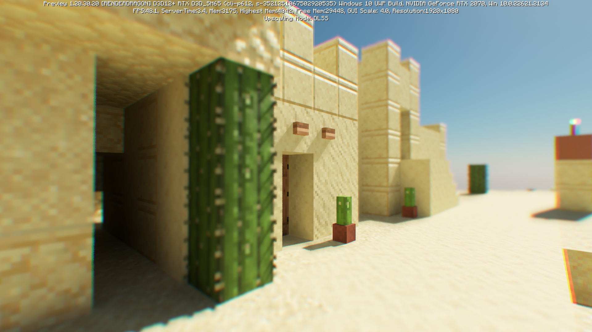

# use this
more good
https://github.com/Cubeir/Vanilla-RTX

# Vanilla RTX Renewed

Vanilla RTX Renewed is a Bedrock PBR resource pack based on Vanilla Normal Renewed.  
It was  created for use when a based PBR resource pack is needed, such as for map making.

## [Please support me at here](https://loot-link.com/s?v5H8)

 
 
 

# ScreenShots

 
 

# Copyright
This refers to the copyright information that was written on VNR and the same conditions will be applied to this resource pack.  

 

---

## [Copyright](https://github.com/Poudingue/Vanilla-Normals-Renewed#copyright)

You can do whatever you want with my texture pack, screenshots, videos, modifications for personal use or redistribution, as long as you don't sell it and provide a link to this page or my Patreon page. Oh, and also, don't mix it with Realistico. Dead serious. Absolutely not a joke. This is not irony, I really insist. I will sue you. 

---
 
 
 
 
 

# Currently Confirmed Bugs
* Material malfunction in Command Blocks
* Incorrect material application for Item Frame and Glowing Item Frame
 
 
 

**Please assist in developing through pull requests.**

 
 
 
 

# VNR
* [GitHub](https://github.com/Poudingue/Vanilla-Normals-Renewed)  
* [Patreon](https://www.patreon.com/Poudingue)
